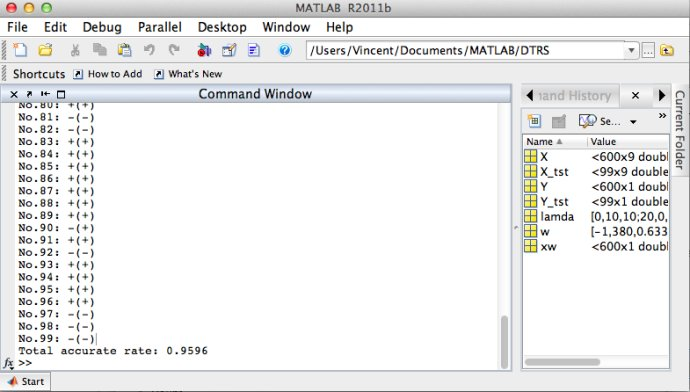

# DTRS

DTRS stands for Decision-Theoretic Rough Sets, introduced by Dr. Yiyu Yao

The conditional probability, i.e., Pr(X|[x]) in the provided code was implemented in Naive Bayes method. The provided code with demo (UCI breast cancer classification) was implemented in Matlab.

The following is the screenshot running the demo on UCI breast cancer data:

